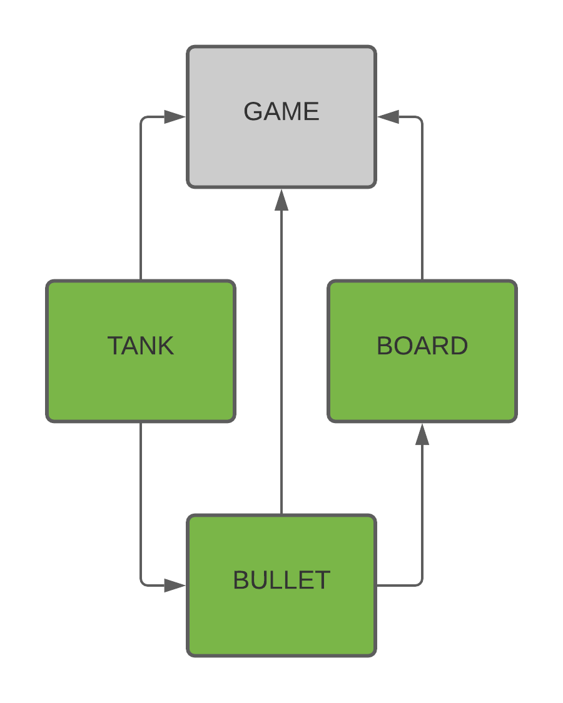

# TANKS GAME PROJECT
## MECHANICS OF THE GAME:
There will be a random board generated everytime the game is loaded. Once the game is loaded, the game consist in killing the other tank by shotting him. The tanks have to move accross the board. 

The board is interconnected, which means no part of the board is isolated from the rest. The tanks will have 100 health points or HP each one. By now, with only one shot the game is over and, there are only two tanks in the war field.  

## DESING IDEA
The following graph explains the classes and their hierarchy that are implemented in the game. 

